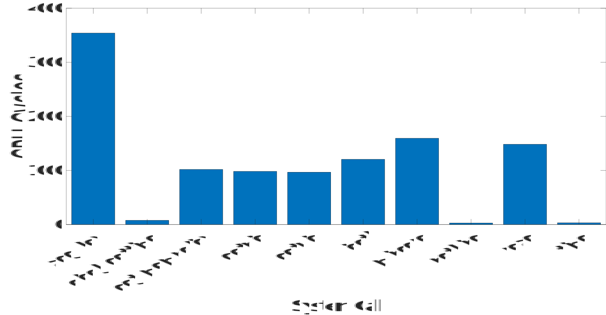

# Benchmarking system calls

This code measures the CPU cycles for various system calls.

## Compile and Execute

```
$ make
$ taskset -c 0 ./syscall_benchmark
```

## Results

The timings are written in text files.

MATLAB code "syscall_benchmark.m" can be used to read the files and plot the results.



### Output on Terminal

```
nothing		29
getpid		1026
getuid		1010
time		34
read		1552
ioctl		1267
add_key		3668
get_mempolicy	1076
clock_gettime	83
mincore		1751
```

## Experimental Setup
We have included the results in the "Results" folder for the following setup:

**Intel® Core™ i5-6440HQ CPU @ 2.60GHz × 4**

**Ubuntu 20.04.4 LTS**
